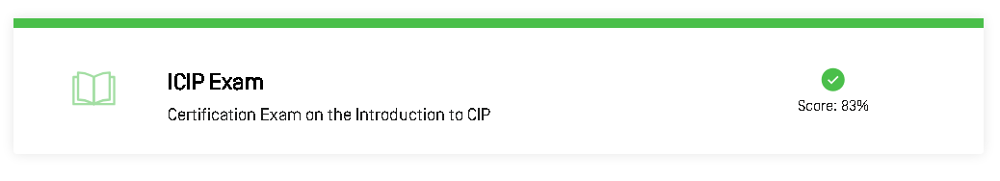
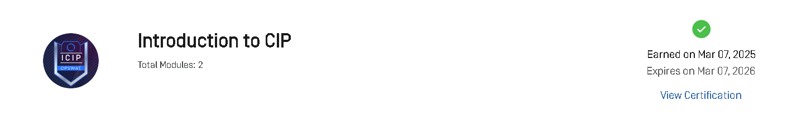

# 🏛️ Introduction to CIP (ICIP – OSWAT)

 
 
 
 
  

This repository contains **notes, labs, policies, research extras, and the certificate of completion** for the *Introduction to CIP (ICIP – OSWAT)* program.  
The course focuses on **Critical Infrastructure Protection (CIP)**, emphasizing **risk management, physical & cybersecurity, incident response, compliance, and international standards**.

---

## 📚 Notes
- 📄 [01-introduction-to-cip.md](./notes/01-introduction-to-cip.md) – Overview of CIP  
- 📄 [02-cip-standards-frameworks.md](./notes/02-cip-standards-frameworks.md) – CIP Standards & Frameworks  
- 📄 [03-risk-assessment.md](./notes/03-risk-assessment.md) – Risk Assessment in CIP  
- 📄 [04-physical-security.md](./notes/04-physical-security.md) – Physical Security in Critical Infrastructure  
- 📄 [05-cybersecurity-in-cip.md](./notes/05-cybersecurity-in-cip.md) – Cybersecurity for CIP Systems  
- 📄 [06-incident-management.md](./notes/06-incident-management.md) – Incident Management & Response  
- 📄 [07-compliance-regulations.md](./notes/07-compliance-regulations.md) – CIP Compliance & Regulations  
- 📄 [08-case-studies-final.md](./notes/08-case-studies-final.md) – Final Case Studies & Applications  

---

## 🧪 Labs
- 🔍 [compliance-audit-lab.md](./labs/compliance-audit-lab.md) – Compliance Audit Lab  
- 🛡️ [cybersecurity-lab.md](./labs/cybersecurity-lab.md) – Cybersecurity Hands-on Lab  
- 🚨 [incident-response-lab.md](./labs/incident-response-lab.md) – Incident Response Simulation  
- 🏢 [physical-security-lab.md](./labs/physical-security-lab.md) – Physical Security Exercise  
- 📊 [risk-assessment-lab.md](./labs/risk-assessment-lab.md) – Risk Assessment Practice  

---

## 📜 Policies
- 🔑 [access-control-policy.md](./policies/access-control-policy.md) – Access Control Policy  
- 🚨 [incident-response-policy.md](./policies/incident-response-policy.md) – Incident Response Policy  
- 🌐 [remote-access-policy.md](./policies/remote-access-policy.md) – Remote Access Policy  
- 🤝 [vendor-management-policy.md](./policies/vendor-management-policy.md) – Vendor Management Policy  

---

## 🔬 Extras
- 📑 [case-studies.md](./extras/case-studies.md) – Real-world Case Studies  
- 📆 [timeline.md](./extras/timeline.md) – Timeline of Key Events in CIP  
- 📚 [resources.md](./extras/resources.md) – Additional Resources for Study  

---

## 📖 Docs
- 📘 [glossary.md](./docs/glossary.md) – CIP Glossary  
- 📘 [index.md](./docs/index.md) – Course Overview  
- 📘 [references.md](./docs/references.md) – References & External Links  
- 📘 [roadmap.md](./docs/roadmap.md) – Learning Roadmap  
- 📘 [syllabus.md](./docs/syllabus.md) – Course Syllabus  

---

## 📸 Screenshots

| Step | Screenshot |
|------|------------|
| 📖 Course Info |  |
| 📑 Modules |  |
| ⭐ Review |  |

---

## 📜 Certificate
🎓 [Introduction to CIP – ICIP OSWAT](./cert/introduction_to_cip.png)

---

## 📝 Personal Review
This course expanded my understanding of **Critical Infrastructure Protection** by covering both **physical and cyber domains**.  
The mix of labs, policies, and compliance exercises helped bridge the gap between **theoretical standards** (like NERC CIP, NIST CSF) and **practical security implementation**.  
It is highly valuable for anyone pursuing **cybersecurity in OT/ICS and national infrastructure security domains**.

---

## ✍️ Author
**Thành Danh** – Red Team Learner & Security Researcher  

- GitHub: [@ngvuthdanhh](https://github.com/ngvuthdanhh)  
- Email: ngvu.thdanh@gmail.com  

---

## 📄 License
This project is licensed under the terms of the **MIT License**. See [LICENSE](./LICENSE) for full details.  
© 2025 ngvuthdanhh. All rights reserved.
